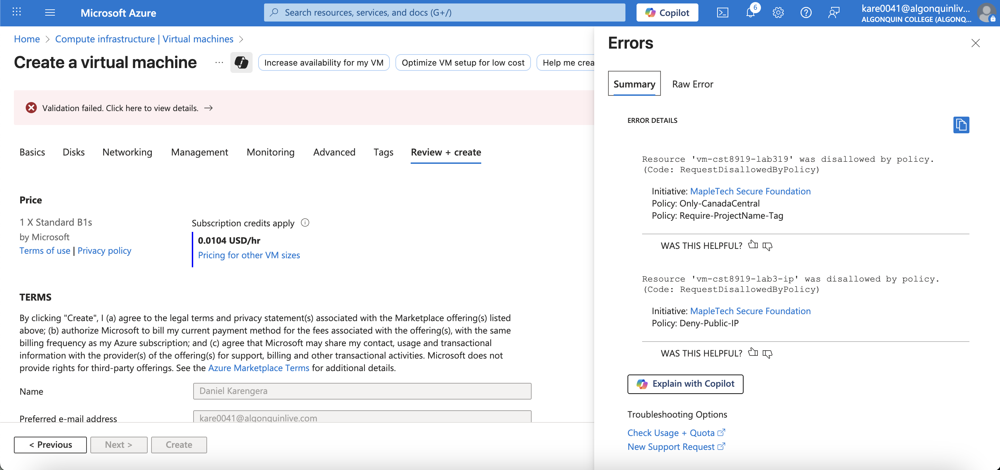
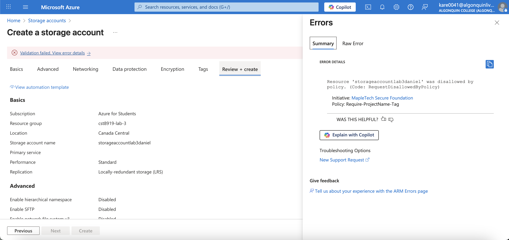
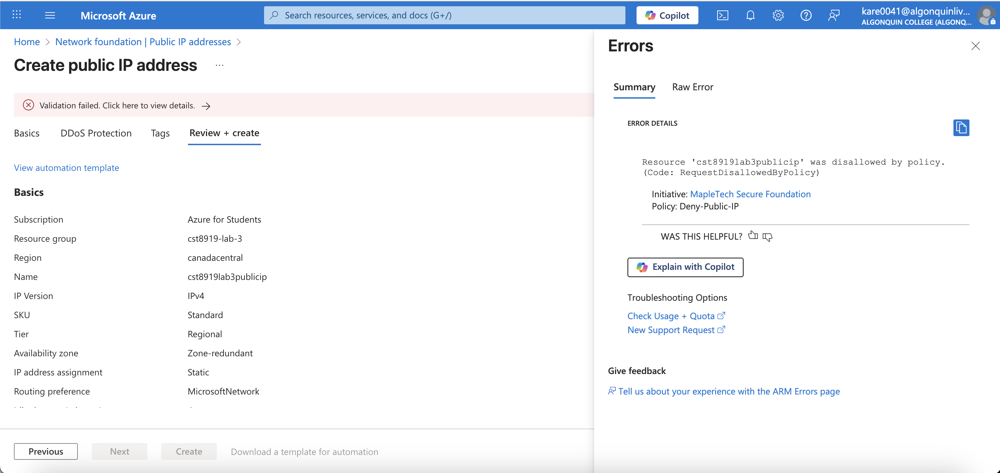
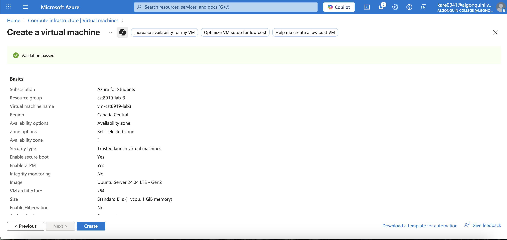

# Azure Policy Lab – Cloud Governance Gone Rogue  
**Course:** CST8919 – DevOps Security and Compliance  
**Lab:** Enforcing Organizational Policies in the Cloud  
**Student:** Daniel Karengera  

## 🎯 Lab Summary  
This lab simulates a real-world scenario at MapleTech Solutions, a fast-growing Canadian cloud-native company. As the newly appointed Cloud Security Engineer, I was tasked with establishing governance and compliance controls using **Azure Policy** to prevent developers from bypassing organizational requirements.

## 🛡️ Policies Implemented

### 1. **Region Lockdown Policy**
- **Name:** Only-CanadaCentral  
- **Effect:** Deny  
- **Description:** Blocks any resource deployment outside the *Canada Central* region to ensure data residency and compliance.

### 2. **Mandatory Tagging Policy**
- **Name:** Require-ProjectName-Tag  
- **Effect:** Deny  
- **Description:** Enforces that every Azure resource includes a `ProjectName` tag to ensure traceability and cost management.

### 3. **Block Public IP Addresses Policy**
- **Name:** Deny-Public-IP  
- **Effect:** Deny  
- **Description:** Prevents the creation of Public IPs, minimizing surface exposure and improving network security posture.

## 🧩 Policy Initiative

- **Initiative Name:** MapleTech Secure Foundation  
- **Policies Included:**  
  - Only-CanadaCentral  
  - Require-ProjectName-Tag  
  - Deny-Public-IP  
- **Category:** Security  
- **Assigned To:** Resource Group  
- **Enforcement Mode:** Enforce (Deny)

## 🚀 Test Scenarios and Outcomes

| Test Action                                      | Expected Outcome | Actual Outcome |
|--------------------------------------------------|------------------|----------------|
| Deploy VM in East US                             | ❌ Denied         | ✅ Denied       |
| Deploy Storage Account without ProjectName tag   | ❌ Denied         | ✅ Denied       |
| Create a Public IP                               | ❌ Denied         | ✅ Denied       |
| Deploy VM in Canada Central with ProjectName tag | ✅ Allowed        | ✅ Allowed      |

> All policies were successfully enforced. Screenshots are available in the [`screenshots/`](./screenshots/) directory.






## 🎥 Video Demo  
[🔗 Watch the Demo Video](https://youtu.be/KibWj8b0wBM)  
*(Max 10 minutes, includes policy creation, test execution, and results)*

## 📁 Lab Folder Structure  
```
/policy-lab
│
├── README.md
├── screenshots/
│   ├── east-us-vm-denied.png
│   ├── no-tag-storage-denied.png
│   ├── public-ip-denied.png
│   └── canada-vm-allowed.png
│
├── policy-definitions/
│   ├── only-canada-central.json
│   ├── require-projectname-tag.json
│   └── deny-public-ip.json
```

## 🧠 Challenges and Lessons Learned

### Challenges:
- Crafting custom policy definitions using JSON required careful schema validation.
- Testing enforcement required understanding which resources are subject to each policy.

### Lessons Learned:
- **Azure Policy** is a powerful tool for implementing proactive governance.
- Initiatives help bundle related policies for consistent enforcement.
- Real-time feedback from Azure Policy (via deny effects) greatly reduces non-compliance risks.
